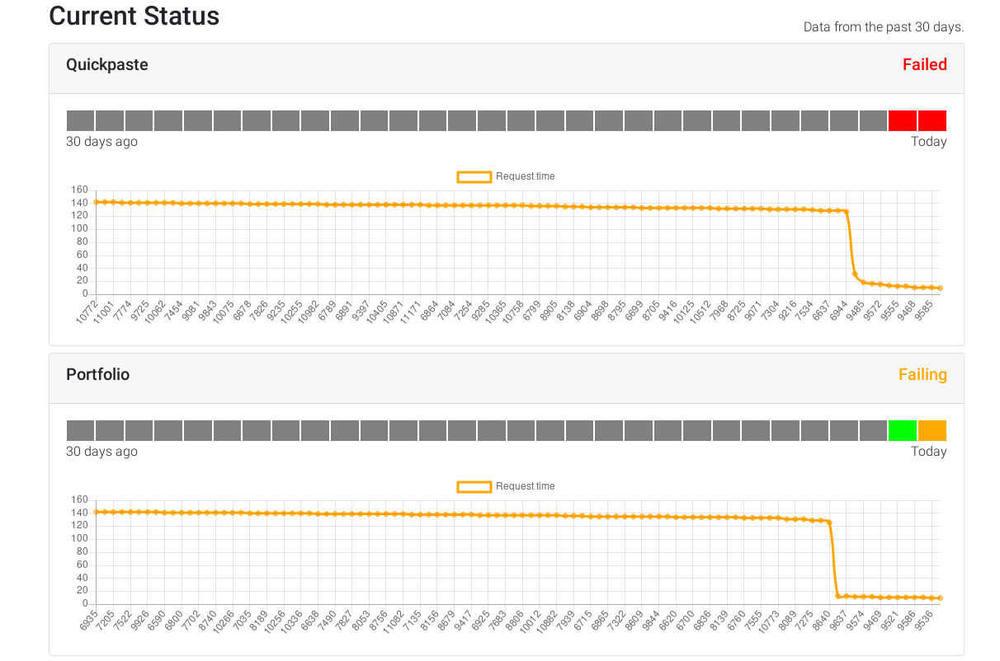

# You Up?
### A simple, self-contained, self-hosted status page with history


### Screenshots


### Try it out
Current git master → [here](https://status.cub3d.pw)

### Running with docker-compose
```yaml
version: '3.7'
services:
 you_up:
   container_name: status
   build:
     context: https://github.com/CUB3D/YouUp.git
   ports:
     - "8102:8102"
   environment:
     RUST_LOG: info
     DATABASE_URL: "<TODO>"
     HISTORY_SIZE: 30
   restart: unless-stopped
```    
See `docker-compose.yaml` for a more complete example